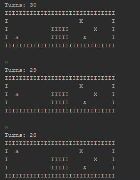
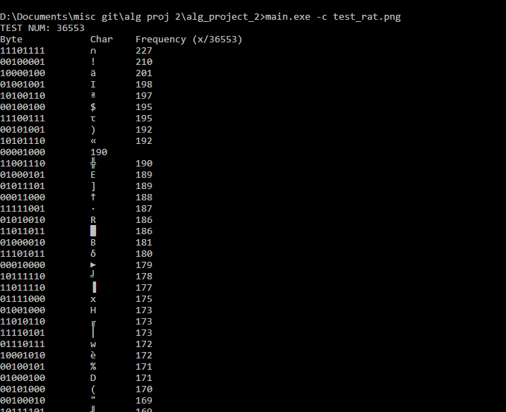
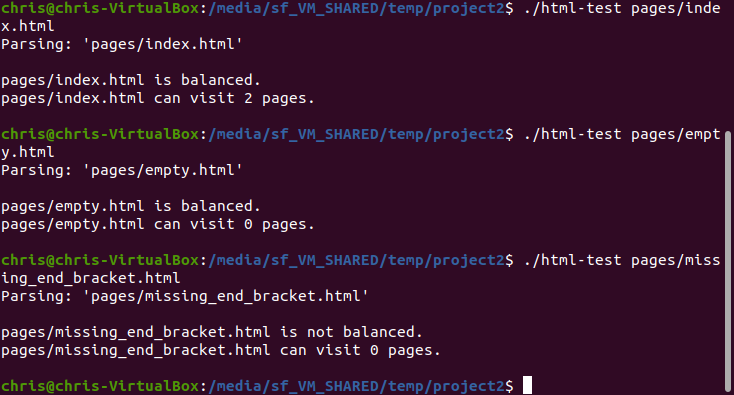

Portfolio
=========

*The grades for the projects/papers/presentations have been lost to time, according to my professors. Apologies.

Programming Projects
--------------------

*For access to my private project repositories, please [email me](mailto:sckoenig@csustudent.net?subject=GitHub%20Access) with the subject line, GitHub Access.

---
### [Escape Room | CSCI 325](project1)

---
### [Data Compressor | CSCI 415](project2)

---
### [HTML Parser | CSCI 315](project3)

---
### [Project 4 Title | CSCI 332](project4)

---

Ethics Papers
-------------

### [Verifying That Which Cannot Be Grasped](https://docs.google.com/document/d/1ZNbeA9MevgD3cjFgzCnxWLkcZggqT354qdBKwbuCpDw/edit?usp=sharing)

-   **Class:** CSCI 315
-   **Grade:** (unknown)

### [Breaches of Privacy - Necessary? Effective?](https://docs.google.com/document/d/1pfkW77enIi5umBod2bzTKs3Vm8uBdAExJs8t-v6PtHY/edit?usp=sharing)

-   **Class:** CSCI 415
-   **Grade:** (unknown)

### [The Inevitability of Licensing](https://docs.google.com/document/d/1kWXfmW7T0jx3ZdKfflAbFLzuGBPuYcCa9EIM1JlUFqo/edit?usp=sharing)

-   **Class:** CSCI 431
-   **Grade:** (unknown)

---

Presentations
-------------

### [Kernel Timer Project](https://docs.google.com/presentation/d/1rUXafzbp572r3mulk9NOJTWv4DAIfTRf4O8L5nXH-sI/edit?usp=sharing)

- **Class:** CSCI 431
- **Grade:** (unknown)

### [Presentation 2 Title](https://youtu.be/Zdrd_YKLtOc)

- **Class:** CSCI 301
- **Grade:** (unknown)
- **Note:** This presentation doesn't make sense with just the slides, so I included a video link.

---

Page template forked from <a href="https://github.com/csu-cs/csci-portfolio">CSU-CS</a>

<!-- Remove above link if you don't want to attributive -->
