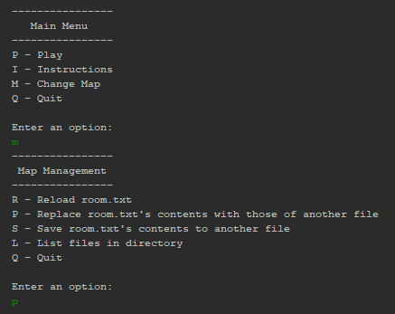
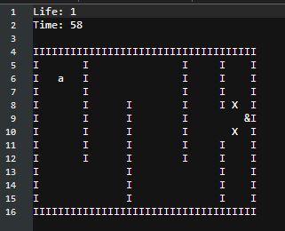

[Back to Portfolio](./)

Escape Room
===============

-   **Class:** Object Oriented Programming
-   **Grade:** (unknown)
-   **Language(s):** Java
-   **Source Code Repository:** [schriskii/escape_room](https://github.com/schriskii/escape_room/)
    (Please [email me](mailto:sckoenig@csustudent.net?subject=GitHub%20Access) to request access.)

## Project description

A simple maze-solving game where users can create their own room designs using text files, determining layout as well as the number of turns and amount of health.

## How to compile and run the program

Open the project in Apache NetBeans 12.0 and click the Run Project button.

## UI Design

Opening the game displays a main menu (see Fig 1) where the player can load in different maps or start playing right away. Gameplay (see Fig 2) is turn-based and the player inputs directions (W, A, S, and D for up, left, down, and right) to move the player (the "a" symbol) through the maze, trying to reach the exit (the "&" symbol) and avoid the hazards (the "X" symbols). Map files (see Fig 3) are simple text files.

  
Fig 1. The launch screen.

  
Fig 2. An example of gameplay.

  
Fig 3. An example room file.

[Back to Portfolio](./)
