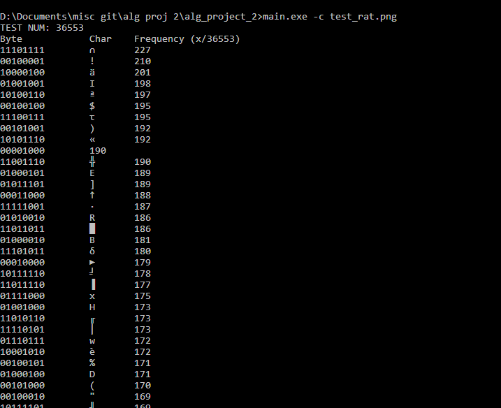

[Back to Portfolio](./)

Data Compressor
===============

-   **Class:** CSCI 415
-   **Grade:** (unknown)
-   **Language(s):** C++
-   **Source Code Repository:** [schriskii/alg-project-2](https://github.com/schriskii/alg-project-2/)  
    (Please [email me](mailto:sckoenig@csustudent.net?subject=GitHub%20Access) to request access.)
-   **Collaboration With:** Carter Hinkle

## Project description

A program which compresses and decompresses files using Huffman encoding. Compressed files are saved with the extension `.huff`.

## How to compile and run the program

Download the source code, and compile and run it with your C++ compiler of choice (e.g. g++). Compile it to an exe, then call it with the arguments:
- `-c` to compress, or `-d` to decompress
- the filename to compress/decompress

e.g.
```compressor.exe -c test.txt```

## UI Design

When compressing a file, the program parses through each byte, displaying it as a char as well as its frequency (see Fig 1). It then displays the Huffman mapping of each char as well as the relative size compared to the original file, and also shows the original file's size (see Fig 2). When decompressing, it displays the size of the compressed file (see Fig 3).

  
Fig 1. Compressing.

  
Fig 2. The end of compressing.

  
Fig 3. Decompressing.

[Back to Portfolio](./)
