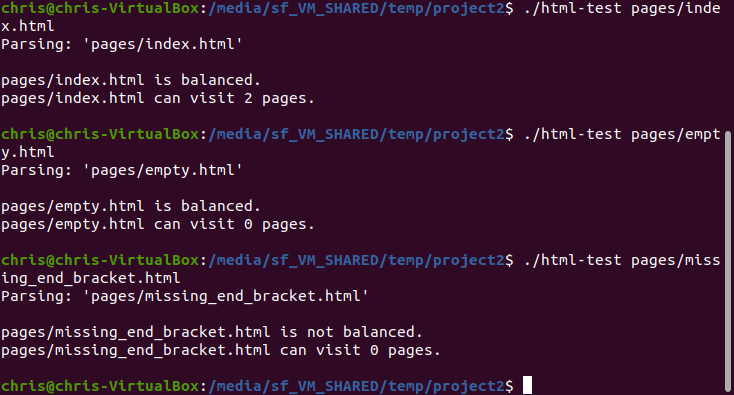

[Back to Portfolio](./)

HTML Parser
===============

-   **Class:** CSCI 315
-   **Grade:** (unknown)
-   **Language(s):** C++
-   **Source Code Repository:** [schriskii/315-proj-2](https://github.com/schriskii/315-proj-2)  
    (Please [email me](mailto:sckoenig@csustudent.net?subject=GitHub%20Access) to request access.)

## Project description

A program which reads an html document file and searches for links to other pages, as well as checking whether or not the tags are properly balanced. It searches the whole web of links to see how many pages can be reached from the initial file, and correctly accounts for cyclical links.

## How to compile and run the program

WIth g++ installed, open the project folder in terminal and type `make`. Run the executable and provide an html document file as the argument.

## UI Design

When run from the command line, the program parses the document, then reports how many links can be visited from it and whether or not the tags are balanced (see Fig 1).

  
Fig 1. Some examples of parsing webpages.

[Back to Portfolio](./)
