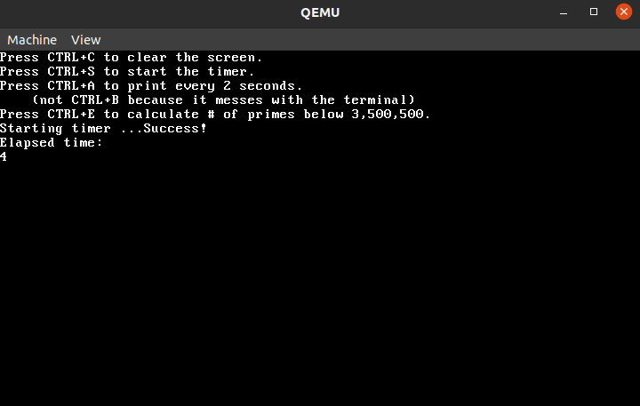
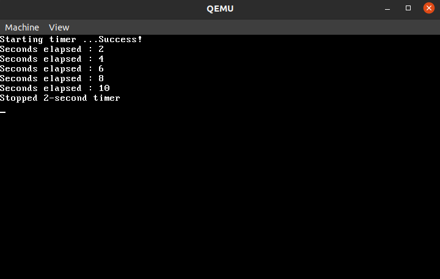

[Back to Portfolio](./)

Kernel Timer
===============

-   **Class:** CSCI 431
-   **Grade:** (unknown)
-   **Language(s):** C
-   **Source Code Repository:** [schriskii/kernel-timer](https://github.com/schriskii/kernel-timer)  
    (Please [email me](mailto:sckoenig@csustudent.net?subject=GitHub%20Access) to request access.)
-   **Collaboration With:** Carter Hinkle, Armando Diaz

## Project description

A kernel add-on which implements a timer to a pre-existing kernel. The timer accurately keeps track of how many seconds have passed. There are also demos included which use the timer to track elapsed time, repeat a task at a set interval, and time how long a calculation takes.

## How to compile and run the program

With `qemu-system-i386` installed, open the project folder in terminal and type `make run`.

## UI Design

When first opened, the kernel shows the user a list of options and key combinations. Pressing ctrl+S starts the timer, and pressing ctrl+S again stops the timer and displays the elapsed time (see Fig 1). Pressing ctrl+A starts the timer and prints a message every two seconds (see Fig 2). Pressing ctrl+E starts the timer and begins searching for prime numbers, then stops the timer and prints the elapsed time after it has found all primes under 3.5 million (see Fig 3) - so it times how long the calculations take.

  
Fig 1. Starting and stopping the timer.

  
Fig 2. Using the timer to print a message to the screen every two seconds.

  
Fig 3. Using the timer to measure the time it takes to find all prime numbers under 3,500,000.

[Back to Portfolio](./)
